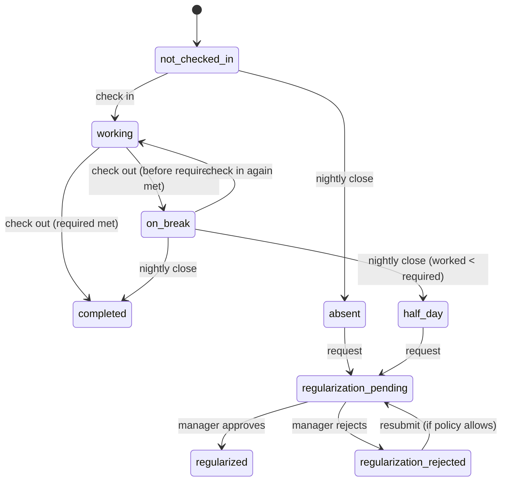

# Attendance module — UI/UX design & implementation plan

Phase 3 of HarkHR. Follows `.claude/phase_one_planning.md` (landing + login) and the
employee directory phase.

---

## 0. Stack reality check — read this first

The brief asks for **Next.js + MUI**. This repository is:

| Asked for | Actually in the repo |
|---|---|
| Next.js | **Vite 8** + `react-router` v7 (`createBrowserRouter`, lazy routes) |
| Material UI | **Tailwind v4**, CSS-first tokens in `src/index.css`, hand-built primitives |
| MUI `DataGrid`, `Dialog`, `Drawer`, `Skeleton`… | `EmployeeTable`, `Modal`, `Drawer`, `Skeleton` already exist in `src/shared/components/ui/` |

### Recommendation: do not add MUI to *this* app

Not a stylistic preference — four concrete costs:

1. **Two design systems, one screen.** MUI ships its own palette, type scale, radii,
   elevation and focus rings. The attendance card would sit next to the employee table
   looking like a different product. Re-theming MUI to match the ink-green/marigold
   tokens is a multi-day job that has to be redone on every MUI major.
2. **Two dialog implementations.** `Modal`/`Drawer` already own focus trapping, Escape,
   scroll lock and focus restoration (`shared/lib/useDialogBehavior.ts`). MUI's `Modal`
   does the same thing differently, and the two fight over `body { overflow }`.
3. **Bundle.** `@mui/material` + `@emotion` + `@mui/icons-material` is ~90–150 kB gzipped
   before `DataGrid`. The whole app today is 112 kB gzipped.
4. **`DataGrid` is the wrong tool anyway** for a 7-row weekly log, and the features that
   make it worth its weight (virtualisation, column pinning, grouping) are **Pro/Premium,
   i.e. paid**.

**If MUI is a hard requirement** (a company mandate, or a fresh Next.js app), everything
below still applies — every section names the MUI component alongside the local one, and
only the "how it looks" chapter changes.

### Component mapping (use this column-wise, whichever stack you land on)

| Purpose | MUI | This repo |
|---|---|---|
| Surface | `Card`, `CardContent` | `div.rounded-card.border.border-ink-200.bg-white` |
| Status pill | `Chip` | `Badge` (`tone`: neutral/brand/accent/danger/success) |
| Primary action | `Button` | `Button` (`variant`, `size`, `isLoading`) |
| Icon action | `IconButton` | `IconButton` (`label` is **required**) |
| Modal | `Dialog` | `Modal` (`eyebrow`/`title`/`description`/`footer`) |
| Side sheet | `Drawer anchor="right"` | `Drawer` |
| Table | `Table` (**not** `DataGrid`) | `EmployeeTable` pattern: real `<table>`, `aria-sort`, `<th scope="col">` |
| Progress | `LinearProgress` | **new** `ProgressBar` (see §3.1) |
| Ring progress | `CircularProgress` | **new** `ProgressRing` (optional) |
| Tabs | `Tabs`/`Tab` | **new** `Tabs` (or plain `NavLink` sub-nav — preferred, see §1.2) |
| Loading | `Skeleton` | `Skeleton` |
| Toast | `Snackbar` | `Toast` (portal, `role="status"`, auto-dismiss) |
| Inline message | `Alert` | `role="alert"` panel (see `EmployeesPage` error state) |
| Tooltip | `Tooltip` | native `title` on `IconButton`; **new** `Tooltip` only if hover-only content is genuinely needed |
| Avatar | `Avatar` | initials tile (`initialsOf`, mono, `bg-brand-50`) |
| Layout | `Stack`, `Grid` | Tailwind `flex`/`grid` utilities |
| Date/month picker | `@mui/x-date-pickers` | native `<input type="month">` / `<input type="date">` + `SelectField` |

**Three new shared primitives** are all this module needs: `ProgressBar`, `Tabs`,
`StatTile`. Everything else already exists.

---

## 1. Page layout

### 1.1 Where attendance lives

Two surfaces, deliberately different in purpose:

| Surface | Route | Job | Rule of thumb |
|---|---|---|---|
| Dashboard widget | `/dashboard` | *Act now.* Check in, check out, "am I done?" | Answerable in **one glance, one click**, no scrolling |
| Attendance page | `/attendance` | *Review and correct.* History, regularisation, analytics | Everything else |

Add to `shared/constants/routes.ts`:

```ts
export const ROUTES = {
  HOME: '/', LOGIN: '/login', DASHBOARD: '/dashboard', EMPLOYEES: '/employees',
  ATTENDANCE: '/attendance',                 // employee's own
  ATTENDANCE_APPROVALS: '/attendance/approvals', // manager only (phase 3b)
} as const
```

`AppShell` already lists **Attendance** under "Later phases" — move it into `NAV_ITEMS`
with `ClockIcon` when this ships.

### 1.2 Attendance page structure

Sub-navigation as **routed tabs**, not `useState` tabs — a filtered history view must be
linkable and survive a refresh. Use `NavLink` styled as tabs (`role` comes free from the
list of links); MUI equivalent is `Tabs` + `component={RouterLink}`.

```
/attendance            → Today      (summary + sessions + today's actions)
/attendance/history    → History    (month selector, filters, day detail drawer)
/attendance/requests   → Requests   (my regularisations + their status)
/attendance/approvals  → Approvals  (manager only; hidden, and route-guarded)
```

### 1.3 Dashboard wireframe (desktop ≥1024px)

The attendance card is the **first** thing in the content column, spanning the width of
the two module tiles. Nothing competes with it.

```
┌───────────────────────────────────────────────────────────────────────────┐
│ TUESDAY · 12 AUG 2026                                    🏢 Office  ▾     │  ← mode picker
│                                                                           │
│  ● Working                          ┌───────────────────────────────────┐ │
│  Checked in 09:15 AM                │                                   │ │
│                                     │        ⏻  Check out               │ │  ← 1 click
│  6h 45m  worked of 8h 00m           │                                   │ │
│  ████████████████████░░░░░  84%     └───────────────────────────────────┘ │
│  Current session 4h 32m · 1h 15m left          Sessions today: 2          │
└───────────────────────────────────────────────────────────────────────────┘
   ↑ status      ↑ elapsed        ↑ progress vs required        ↑ the action
```

Hierarchy, top to bottom, matches the brief: status → action → worked → required →
sessions. The mode chip is a control (it must be settable *before* check-in) but is
visually quiet: small, top-right, secondary weight.

### 1.4 Mobile (<640px)

The card becomes a single column, and the action goes **full-width at the bottom** of the
card — thumb reach. Progress bar stays. "Sessions today: 2" collapses into a link to
`/attendance`.

---

## 2. Component hierarchy

Mirrors the `features/employees/` slice exactly, so the codebase stays legible.

```
src/features/attendance/
├─ api/
│  └─ attendanceApi.ts          # the ONLY file that knows HTTP exists (mirrors employeeApi)
├─ types.ts                     # Attendance*, AttendanceError + codes
├─ lib/
│  ├─ duration.ts               # minutes → "6h 45m"; one formatter, one rounding rule
│  ├─ serverClock.ts            # server-time offset (see §12) — no `new Date()` elsewhere
│  ├─ attendanceState.ts        # pure: day record → DayState + which actions are legal
│  ├─ workedMinutes.ts          # pure: sessions[] + now → worked/current/remaining
│  └─ weekRange.ts              # pure: week bounds honouring the org's first weekday
├─ hooks/
│  ├─ useTodayAttendance.ts     # fetch + poll-on-focus + optimistic check-in/out
│  ├─ useAttendanceWeek.ts
│  ├─ useAttendanceMonth.ts     # days + analytics summary
│  ├─ useRegularizations.ts
│  └─ useTicker.ts              # 1s tick, isolated (see §7.2)
├─ components/
│  ├─ AttendanceCard.tsx           # dashboard widget (composition only)
│  ├─ AttendanceStatus.tsx         # dot + label, one place that maps state → words/tone
│  ├─ CheckInOutButton.tsx         # the state machine's one button
│  ├─ AttendanceModePicker.tsx     # Office / Remote
│  ├─ AttendanceProgress.tsx       # worked vs required, with the numbers
│  ├─ LiveDuration.tsx             # ticking text, isolated re-render
│  ├─ TodaySummary.tsx
│  ├─ AttendanceSessionList.tsx
│  ├─ AttendanceSessionRow.tsx
│  ├─ WeeklyAttendanceTable.tsx    # <table> ≥768px
│  ├─ WeeklyAttendanceCards.tsx    # cards <768px
│  ├─ AttendanceAnalytics.tsx      # 4 StatTiles + optional secondary row
│  ├─ AttendanceHistoryFilters.tsx
│  ├─ AttendanceDetailsDrawer.tsx  # one day, everything about it
│  ├─ RegularizationDialog.tsx     # create / edit a request
│  └─ RegularizationStatus.tsx     # pending / approved / rejected + reviewer note
└─ pages/
   ├─ AttendanceTodayPage.tsx
   ├─ AttendanceHistoryPage.tsx
   ├─ AttendanceRequestsPage.tsx
   └─ AttendanceApprovalsPage.tsx  # manager
```

Shared additions: `shared/components/ui/ProgressBar.tsx`, `Tabs.tsx`, `StatTile.tsx`.

**The rule that keeps this clean** (unchanged from phase 1): `shared/` never imports from
`features/`. `AttendanceCard` is imported *by* the dashboard page, not the other way round.

---

## 3. Attendance state handling

### 3.1 The day state machine

One union, derived on the **server** and re-derived on the client from the same rules, so
a stale tab and a fresh one cannot disagree about what today is.

```ts
export type DayState =
  | 'not_checked_in'          // working day, nothing recorded yet
  | 'working'                 // an open session exists
  | 'on_break'                // ≥1 closed session, none open, day not finalised
  | 'completed'               // finalised: required hours met (or day closed by the job)
  | 'absent'                  // finalised working day with no sessions
  | 'half_day'                // finalised, worked ≥ half but < required
  | 'regularization_pending'
  | 'regularized'             // request approved, record amended
  | 'regularization_rejected'
  | 'leave'                   // approved leave covers the day
  | 'holiday'
  | 'weekend'
```



`weekend`, `holiday` and `leave` are **assigned when the day is generated**, not entered
by transition. They are terminal and no action is offered on them.

### 3.2 Which action is legal

`lib/attendanceState.ts` is a pure function and the single source of truth. The button,
the row action and the API guard all read it — three places cannot drift.

```ts
export type Action = 'check_in' | 'check_out' | 'regularize' | 'view' | 'none'

export function primaryActionFor(day: AttendanceDay, role: Role): Action {
  switch (day.state) {
    case 'not_checked_in':
    case 'on_break':                 return 'check_in'
    case 'working':                  return 'check_out'
    case 'absent':
    case 'half_day':
    case 'regularization_rejected':  return canRegularize(day, role) ? 'regularize' : 'view'
    default:                         return 'view'
  }
}
```

`canRegularize` encodes the *policy*, and policy belongs in one function: within the
regularisation window (e.g. 7 days), not a weekend/holiday, no request already pending,
under the monthly cap.

### 3.3 State → words and colour

One map, in `AttendanceStatus.tsx`. Never colour alone — every state carries a **word**,
because a green dot means nothing to a colour-blind user or a screen reader.

| State | Label | Tone | Dot |
|---|---|---|---|
| `not_checked_in` | Not checked in | neutral | hollow |
| `working` | Working | brand | pulsing brand |
| `on_break` | On break | accent | accent |
| `completed` | Completed | success | filled success |
| `half_day` | Half day | accent | accent |
| `absent` | Absent | danger | danger |
| `regularization_pending` | Regularisation pending | accent | accent, hollow |
| `regularized` | Regularised | success | success, hollow |
| `regularization_rejected` | Regularisation rejected | danger | danger, hollow |
| `leave` | On leave | brand | brand, hollow |
| `holiday` | Holiday | neutral | — |
| `weekend` | Weekend | neutral | — |

---

## 4. Check-in / check-out UX flow

### 4.1 The happy path

```
[Check in] ─click─► button → isLoading, optimistic state = 'working', session start = serverNow()
                 └─► POST /attendance/check-in { mode, location?, idempotency_key }
                       ├─ 201 → replace optimistic time with the SERVER's timestamp
                       │        toast "Checked in at 09:15 AM"
                       └─ 4xx/5xx → roll back to 'not_checked_in', inline error, keep the button live
```

**Optimistic, but reconciled.** The button must flip instantly — this is the one
interaction people do twice a day while holding a coffee. But the displayed time is
replaced by the server's the moment it answers, and the two can differ by a second or two.
Never keep the client's guess.

### 4.2 Duplicate check-in prevention — three layers

1. **UI:** the button is `disabled` while `isLoading` (already how `Button` behaves with
   `isLoading`), and the optimistic state removes the check-in affordance immediately.
2. **Request:** an `idempotency_key` (UUID generated once per click, reused on retry).
   The server returns the *same* session for a repeated key instead of opening a second.
3. **Database:** the real guard. A unique index that permits **at most one open session
   per employee** — in MySQL, a generated column `open_marker = IF(check_out_at IS NULL,
   employee_id, NULL)` with `UNIQUE KEY (open_marker)`. Two racing requests: one wins,
   the other gets a 409, and the client refetches rather than showing an error.

Layers 1 and 2 are courtesy. Layer 3 is what makes it true.

### 4.3 Check-out confirmation — conditional, not always

A confirmation on *every* checkout is a dialog people learn to dismiss without reading, so
it stops protecting anything. Confirm **only** when checking out would leave the day
short:

> **Check out at 4h 12m?**
> You are 3h 48m under your 8h 00m for today. You can check in again later.
> [ Keep working ] [ Check out anyway ]

Otherwise check out immediately and report it in a toast with an **Undo** (see §12.6).

### 4.4 Attendance mode (Office / Remote)

- Chosen **before** check-in, defaulting to the employee's usual mode from their profile.
- Recorded **per session**, not per day — mornings in the office and afternoons at home
  are one of the most common real patterns, and a day-level flag cannot express it.
- **No silent geolocation.** Asking the browser for coordinates on page load is a permission
  prompt nobody expected and a privacy problem. Options, in order of preference:
  1. Employee picks; server records the request's IP-derived site as corroboration.
  2. If the org enables geofencing, request geolocation **on the click**, explain why in
     one line, and **never block check-in if it is denied** — record `mode: 'remote',
     location_verified: false` and let the manager see that.
- Displayed as a small `Badge` with an icon; it must be visible and must not compete with
  the hours.

---

## 5. Multiple sessions

### 5.1 Model

A day **is** its list of sessions. `worked_minutes` is never stored as a client-editable
number — it is the sum of the sessions, computed by:

```ts
export function workedMinutes(sessions: Session[], now: Date): {
  total: number; current: number | null
} {
  let total = 0
  let current: number | null = null
  for (const s of sessions) {
    const end = s.checkOutAt ?? now          // an open session is measured to "now"
    const minutes = diffMinutes(s.checkInAt, end)
    total += minutes
    if (!s.checkOutAt) current = minutes
  }
  return { total, current }
}
```

Pure, and unit-tested against: no sessions, one open session, several closed, an open
session crossing midnight, and a session with `checkOut < checkIn` (clock skew → clamp to
0 and flag the record rather than showing negative hours).

### 5.2 Sessions card

```
SESSIONS TODAY                                                     2 sessions
┌──────────────────────────────────────────────────────────────────────────┐
│ 01   09:15 AM → 01:00 PM      3h 45m    🏢 Office     Completed           │
│ 02   02:00 PM → ·······       4h 32m    🏠 Remote     ● Running           │
└──────────────────────────────────────────────────────────────────────────┘
  Worked 8h 17m   ████████████████████████░  Required 8h 00m   Remaining 0h
```

Numbering **is** meaningful here (they are sequential in time), so `01/02` earns its place.
The running session's duration ticks; every other number is static.

---

## 6. Weekly attendance log

`<table>` at ≥768px, cards below. Not a `DataGrid`: seven rows, no virtualisation needed,
and a real table gives "row 3 of 7, Worked hours, 8h 20m" to a screen reader for free.

```
DAY  DATE     STATUS      IN      OUT     WORKED   MODE     
Mon  10 Aug   Present     09:15   18:05   8h 20m   Office    [View]
Tue  11 Aug   Present     09:30   18:15   8h 10m   Remote    [View]
Wed  12 Aug   Absent      —       —       —        —         [Regularise]
Thu  13 Aug   ● Working   09:15   —       6h 45m   Office    [View]
Fri  14 Aug   Holiday · Independence Day                     
Sat  15 Aug   Weekend
Sun  16 Aug   Weekend
```

- Weekend/holiday rows collapse to one muted cell — dashes in six columns imply missing
  data on a day when nothing was owed.
- Today's row is marked (left marigold rule, same device as the active nav item).
- The action column is per-state (`primaryActionFor`), so "Regularise" only appears where
  it is legal.
- Row totals in a `<tfoot>`: **Week total 31h 15m of 40h 00m**.
- **Mobile:** each day becomes a card — day/date + status chip on the first line, times and
  hours on the second, action as a full-width secondary button. Same data, no sideways
  scrolling.

---

## 7. Today's summary + the live timer

### 7.1 Summary block

Six facts, in the order the brief lists them, as a `<dl>`: check-in, status, current
session, total worked, required, remaining, mode. Only "current session" and "total
worked" tick.

### 7.2 The ticking timer — three rules

1. **Isolate the re-render.** The tick lives in `<LiveDuration from={…} />`, which owns its
   own interval and renders one text node. Putting the ticking value in the page's state
   re-renders the table, the analytics and the session list once per second.
2. **Compute from timestamps, never increment a counter.** Background tabs throttle
   `setInterval` to once a minute or less; an incrementing counter silently loses time and
   the employee's hours come out wrong. `now - checkInAt`, every time.
3. **Pause and resync.** On `visibilitychange` → hidden, clear the interval; on visible,
   recompute immediately and restart. Also refetch `/attendance/today` on focus — the
   employee may have checked out on their phone.

The ticker is `aria-hidden`. See §15.

---

## 8. Regularisation workflow

### 8.1 The flow

```
Employee                          Manager                        System
   │ opens RegularizationDialog      │                              │
   │ submits (date, in, out, mode,   │                              │
   │          reason, remarks)       │                              │
   ├────────── POST ────────────────►│                              │
   │ day.state = regularization_pending  (optimistic, then confirmed)│
   │                                 │ sees it in /attendance/approvals
   │                                 ├── approve ──────────────────►│ amends the day,
   │                                 │                              │ state = regularized
   │                                 └── reject (reason required) ──►│ state = rejected
   │◄──── toast + row status update / email or in-app notification ──┘
```

### 8.2 The dialog

`Modal` on desktop, full-height `Drawer` on mobile (a 400px-tall dialog with a keyboard
over it is unusable on a phone).

```
REGULARISATION                                                        [×]
Regularise 11 Aug 2026
Tuesday · currently marked Absent

  Recorded now        No sessions recorded
  ────────────────────────────────────────────────────────────────────
  Check-in *          [ 09:30 AM ]        Check-out *   [ 06:15 PM ]
  Mode *              (•) Office   ( ) Remote
  Reason *            [ Forgot to check in ▾ ]
  Details *           [ Was in the Pune office all day, badge log will  ]
                      [ confirm.                                        ]
  Attachment          [ Choose file ]  Optional · PDF or image, max 5 MB
  ────────────────────────────────────────────────────────────────────
  This goes to Priya Desai for approval.        [ Cancel ] [ Submit request ]
```

**Validation, client and server (the same rules, stated once in a Zod schema):**

| Rule | Message |
|---|---|
| Date within the regularisation window | "Requests can only be raised within 7 days." |
| `check_out > check_in` | "Check-out must be after check-in." |
| Duration ≤ 16h | "That is longer than a working day. Check the times." |
| Not a weekend/holiday unless policy allows | "No attendance is expected on a holiday." |
| Reason chosen from a list + free-text details ≥ 20 chars | "Add a sentence your manager can act on." |
| No pending request already on that date | "A request for this date is already awaiting approval." |

A **reason dropdown plus free text**, not free text alone: the dropdown is what makes
"why does this team regularise 40 times a month?" answerable later, and it stops the
approval queue filling with "forgot".

### 8.3 Status display

The row/card shows a `Badge` and, for rejected requests, the reviewer's note inline — a
rejection with no reason generates a Slack message to the manager, every time.

---

## 9. Monthly analytics

Four `StatTile`s, then an optional secondary row. **Every number needs a defined formula**,
or HR and the employee will compute attendance percentage differently and both will be
sure they are right.

| Tile | Value | Formula |
|---|---|---|
| Present days | 20 | days with `state ∈ {completed, half_day(0.5), regularized}` |
| Attendance % | 91% | `present_days / working_days`, where `working_days` excludes weekends, holidays **and approved leave** |
| Absent days | 2 | `state = absent` and no approved regularisation |
| Leaves taken | 3 | approved leave days in the month |

Secondary (collapsed under "More"): total working days, total worked hours, average day,
late check-ins (> grace after shift start), early check-outs, regularisations raised/approved.

- Each tile states its denominator in small text ("of 22 working days"), because a bare
  "91%" invites the question and a tooltip nobody opens does not answer it.
- **Not charts.** Four numbers do not need four donuts. One sparkline of daily hours across
  the month is worth more than all of them — add it only when a month of real data exists.
- Half days count as 0.5 in the percentage and are shown as "20.5" — rounding them up is
  how payroll disputes start.

---

## 10. Attendance history

- **Month selector** (`<input type="month">` or prev/next chevrons with a label), plus an
  optional custom date range.
- **Filters:** status (multi), mode (office/remote/any), "only regularised", search.
- **URL is the state**: `/attendance/history?month=2026-08&status=absent,half_day&mode=remote`.
  Sharable with a manager, survives refresh, back button works. This is the reason tabs are
  routes (§1.2).
- Reuse the employees table's proven pieces: sortable headers with `aria-sort`, the
  `Pagination` bar, the "nothing matches those filters" empty state distinct from "no
  records".
- **Row click → `AttendanceDetailsDrawer`** (never straight into an edit form):
  all sessions with times/durations/modes, worked vs required, the regularisation history
  with who approved it and when, and the audit line ("recorded from 10.2.1.14, Pune office").

---

## 11. Every state, and what it shows

| State | Card shows | Primary action | Notes |
|---|---|---|---|
| **Loading** | `Skeleton` in the card's exact shape | — | Never a spinner in place of the layout |
| **Not checked in** | Date, required hours, 0% progress | **Check in** | Mode picker enabled |
| **Working** | Live session, live total, progress | **Check out** | Pulsing status dot |
| **On break** | Sessions so far, total, progress | **Check in** | "2 sessions · 3h 45m so far" |
| **Completed** | Final total, ✓, sessions | View day | Action becomes secondary |
| **Absent (past day)** | "No attendance recorded" | **Regularise** | Only inside the window |
| **Regularisation pending** | Requested times, reviewer name | Withdraw (if policy) | Accent badge |
| **Approved** | Amended times + "Regularised by …" | View | Success badge |
| **Rejected** | Reason from the reviewer | Resubmit (if policy) | Danger badge + the note |
| **Holiday** | Holiday name | — | "No attendance needed today" |
| **Weekend** | — | — | Quietly muted, not an error |
| **Leave** | Leave type + approval | — | "Approved leave — casual" |
| **API error** | `role="alert"` panel + **Try again** | Retry | Never lose the typed state |
| **Offline** | Banner "You are offline — check-in will be sent when you reconnect" | Queue | See §12.7 |

---

## 12. API and data model

### 12.1 Tables (MySQL, matching the existing `Employee` conventions)

```sql
CREATE TABLE attendance_session (
  id             BIGINT AUTO_INCREMENT PRIMARY KEY,
  employee_id    INT NOT NULL,
  work_date      DATE NOT NULL,               -- the day it is *counted* against
  check_in_at    DATETIME(3) NOT NULL,        -- UTC, always
  check_out_at   DATETIME(3) NULL,
  mode           ENUM('office','remote') NOT NULL,
  location_label VARCHAR(120) NULL,
  source         ENUM('web','mobile','kiosk','regularization') NOT NULL DEFAULT 'web',
  location_verified TINYINT(1) NOT NULL DEFAULT 0,
  idempotency_key CHAR(36) NULL,
  created_at     DATETIME(3) NOT NULL DEFAULT CURRENT_TIMESTAMP(3),
  updated_at     DATETIME(3) NOT NULL DEFAULT CURRENT_TIMESTAMP(3) ON UPDATE CURRENT_TIMESTAMP(3),
  -- at most one OPEN session per employee (see §4.2)
  open_marker    INT GENERATED ALWAYS AS (IF(check_out_at IS NULL, employee_id, NULL)) STORED,
  UNIQUE KEY uq_open_session (open_marker),
  UNIQUE KEY uq_idempotency (employee_id, idempotency_key),
  KEY idx_employee_date (employee_id, work_date),
  CONSTRAINT fk_session_employee FOREIGN KEY (employee_id) REFERENCES Employee(id)
);

CREATE TABLE attendance_day (               -- rollup, written by the nightly close job
  employee_id      INT NOT NULL,
  work_date        DATE NOT NULL,
  state            VARCHAR(32) NOT NULL,
  required_minutes SMALLINT NOT NULL,
  worked_minutes   SMALLINT NOT NULL DEFAULT 0,
  first_check_in   DATETIME(3) NULL,
  last_check_out   DATETIME(3) NULL,
  finalised_at     DATETIME(3) NULL,
  PRIMARY KEY (employee_id, work_date)
);

CREATE TABLE attendance_regularization (
  id              BIGINT AUTO_INCREMENT PRIMARY KEY,
  employee_id     INT NOT NULL,
  work_date       DATE NOT NULL,
  requested_in    DATETIME(3) NOT NULL,
  requested_out   DATETIME(3) NOT NULL,
  mode            ENUM('office','remote') NOT NULL,
  reason_code     VARCHAR(40) NOT NULL,
  details         VARCHAR(500) NOT NULL,
  attachment_url  VARCHAR(300) NULL,
  status          ENUM('pending','approved','rejected','withdrawn') NOT NULL DEFAULT 'pending',
  reviewer_id     INT NULL,
  reviewed_at     DATETIME(3) NULL,
  review_note     VARCHAR(500) NULL,
  created_at      DATETIME(3) NOT NULL DEFAULT CURRENT_TIMESTAMP(3),
  UNIQUE KEY uq_pending (employee_id, work_date, status)   -- one pending per day
);
```

Supporting: `work_policy` (required minutes, grace, week start, regularisation window),
`holiday_calendar`, and the existing leave records when that module lands.

### 12.2 Endpoints

| Method | Path | Returns / body |
|---|---|---|
| GET | `/attendance/today` | day state, sessions, required/worked, `server_time` |
| POST | `/attendance/check-in` | `{ mode, location_label?, idempotency_key }` → 201 session; **409** if one is open |
| POST | `/attendance/check-out` | `{ session_id, idempotency_key }` → 200 session; 409 if already closed |
| GET | `/attendance/week?start=YYYY-MM-DD` | 7 day records + week totals |
| GET | `/attendance/month?month=YYYY-MM` | day records + the analytics summary, computed server-side |
| GET | `/attendance/day/:date` | one day: sessions, regularisations, audit |
| POST | `/attendance/regularizations` | create → 201 |
| GET | `/attendance/regularizations?status=` | mine |
| POST | `/attendance/regularizations/:id/withdraw` | employee |
| GET | `/attendance/approvals?status=pending` | **manager**: their reports' requests |
| POST | `/attendance/regularizations/:id/approve` \| `/reject` | **manager**, `{ note }` — required on reject |

Wire format stays **snake_case**, converted to camelCase in `api/attendanceApi.ts` — the
same boundary discipline as `employeeApi.ts`, so no component ever sees `check_in_at`.

### 12.3 Today payload

```jsonc
{
  "server_time": "2026-08-12T13:45:09.221Z",   // the client's clock reference
  "work_date": "2026-08-12",
  "state": "working",
  "required_minutes": 480,
  "worked_minutes": 405,                        // closed sessions only
  "policy": { "grace_minutes": 15, "half_day_minutes": 240, "regularization_window_days": 7 },
  "sessions": [
    { "id": 88, "check_in_at": "2026-08-12T03:45:00.000Z", "check_out_at": "2026-08-12T07:30:00.000Z",
      "mode": "office", "location_label": "Pune HQ" },
    { "id": 91, "check_in_at": "2026-08-12T08:30:00.000Z", "check_out_at": null,
      "mode": "remote", "location_label": null }
  ]
}
```

Note what is **absent**: no "current session duration", no "remaining". Those are functions
of `now` and are computed on the client, once, in `workedMinutes()`. Sending a duration
that starts ageing the moment it is serialised is the classic attendance bug.

### 12.4 Timezone — the rules

1. **Store UTC.** `DATETIME(3)` in UTC, everywhere, no exceptions.
2. **The server stamps the time.** The client never sends "when" — it sends "check me in".
   A laptop clock that is 20 minutes fast must not become 20 minutes of pay.
3. **`work_date` is computed in the employee's *work* timezone**, not the browser's and not
   the server's. A 00:30 check-in in IST belongs to that date in IST.
4. **Display in the employee's timezone** via `Intl.DateTimeFormat` with an explicit
   `timeZone`, formatted in one module (`lib/duration.ts` + a `formatTime` helper) —
   never `toLocaleTimeString()` scattered across components.
5. **Clock skew:** `serverClock.ts` records `offset = server_time − Date.now()` at load and
   every fetch; all elapsed-time maths uses `serverNow() = Date.now() + offset`. Skew > 2
   minutes shows a quiet warning — it means their machine's clock is wrong.
6. **Midnight and DST:** a session open at midnight is closed by the nightly job at 23:59:59
   local and reopened, so no session spans two `work_date`s. Durations use absolute UTC
   instants, so a DST shift never invents or deletes an hour.

---

## 13. State management

**No Redux, no Zustand, no TanStack Query for this phase** — the same reasoning as
`useEmployees`, which the codebase already documents: a handful of screens reading a
handful of endpoints does not need a cache library, and the wrong abstraction is more
expensive than the duplication.

| Concern | Where it lives |
|---|---|
| Server data (today/week/month) | Per-resource hooks with the **stale-response guard** (`latestRequestId` ref) already proven in `useEmployees` |
| Filters, month, sort, page | URL search params (`useSearchParams`) — shareable, survives refresh |
| Which dialog is open | One `useState` discriminated union in the page (`Dialog = {kind:'regularize', day} | …`) — the pattern `EmployeesPage` uses |
| The 1-second tick | `useTicker` inside `LiveDuration` only |
| Server-clock offset | Module-level singleton in `lib/serverClock.ts`, updated by every response |
| Auth/role | Existing `AuthProvider` |

**Refetch triggers:** on mount, after a successful mutation, on window focus, and on
`online`. Not a polling interval — a 30-second poll on a page nobody is looking at is
7,000 pointless requests a day per user.

**When to reach for TanStack Query:** when manager approvals arrive and three screens want
the same request list with background refresh. Then it replaces the hooks and nothing else
— which is exactly why the hooks are the only thing that touches the API.

---

## 14. Responsive behaviour

| Breakpoint | Dashboard card | Weekly log | Sessions | Analytics | Dialogs |
|---|---|---|---|---|---|
| < 640 (mobile) | Single column, full-width action at the bottom | **Cards**, one per day | Stacked rows | 2×2 grid | `Drawer`, full height |
| 640–1023 (tablet) | Two columns (facts / action) | Table, mode + action columns dropped | Rows | 2×2 or 4-up | `Modal`, `max-w-lg` |
| ≥ 1024 (laptop) | Full card as wireframed | Full table | Rows | 4-up | `Modal`, `max-w-2xl` |
| ≥ 1440 | Card + analytics side by side | Full table + week total | Rows | 4-up + secondary row | unchanged |

Tables never scroll the page sideways: horizontal scroll belongs to the table's own
wrapper (`overflow-x-auto`), exactly as `EmployeeTable` does it.

---

## 15. Accessibility

Non-negotiables, most of which are already habits in this codebase:

- **The ticking timer is `aria-hidden`.** A polite live region that updates every second
  makes a screen reader unusable. Announce **transitions** instead: on check-in, one
  `role="status"` toast — "Checked in at 9:15 AM, office."
- **Status is never colour alone.** Dot + word + `Badge` tone, always all three.
- **The primary button's accessible name says what will happen** — "Check out", not "Submit".
  It changes with the state, and the change is announced because the button's text changes.
- **Focus after an action stays put.** Check-in swaps the button's label in place; focus
  must not jump to the top of the card. After a dialog closes, focus returns to the trigger
  (`useDialogBehavior` already does this).
- **Weekly table:** `<caption>` (sr-only), `<th scope="col">`, `aria-sort` on the sorted
  column, and per-row action labels that name the day — "Regularise Wednesday 12 August",
  not twelve buttons called "Regularise".
- **The regularisation form:** `<fieldset>`/`<legend>` per group, every field labelled,
  errors wired with `aria-describedby` + `role="alert"`, and time inputs that accept typing
  as well as a picker.
- **Contrast:** the existing tokens are checked — brand-600 on white is 7.2:1, accent-400 is
  a *fill* colour and never carries small text.
- **Keyboard:** everything reachable in a sensible order; `Escape` closes dialogs; consider
  one shortcut (`Shift+C` to check in/out) advertised in the UI, not hidden.
- **Reduced motion:** the pulsing "working" dot is an animation — it is already covered by
  the global `prefers-reduced-motion` block in `index.css`, which switches it off.

---

## 16. Production recommendations

1. **Role-based access.** `ProtectedRoute` gains a `roles` prop; `/attendance/approvals` is
   both route-guarded *and* server-authorised. A hidden nav item is not access control.
2. **The nightly close job** is the backbone: it finalises days, marks absences, applies
   holidays and leave, and closes sessions left open. Make it idempotent and re-runnable
   for a date range — you will re-run it.
3. **Never let the browser decide payroll numbers.** The client computes what it displays;
   the server computes what is stored and reported. They use the same rules, and the
   server's answer wins on every refresh.
4. **Audit everything.** Who changed a record, when, from where, and why. Attendance data
   ends up in pay disputes and, in India, in statutory registers.
5. **Rate-limit check-in/out** per employee (a jittery connection plus an impatient click is
   ten requests) — the idempotency key makes them harmless, the limit makes them cheap.
6. **Undo beats confirm.** A 10-second "Checked out — Undo" in the toast is friendlier than a
   modal on every checkout, and it is the same one request to reverse.
7. **Offline:** the check-in click is the one action worth queueing. Store the intent with its
   idempotency key, replay on `online`, and be explicit that the *server's* time on arrival
   is what gets recorded — or hold the intended instant and let the server validate it.
8. **Feature-flag the module** so it can ship dark, and keep the sidebar item on "soon" until
   the nightly job has run correctly for a week.
9. **Empty months are normal.** A new joiner opening History sees "Nothing recorded before
   3 August — your first day", not an empty table.
10. **Instrument the funnel**: check-ins per day by source, regularisations per employee per
    month, approval latency. If regularisations climb, the check-in flow is broken — that
    metric is the module's smoke alarm.

---

## Suggested phasing

| Phase | Scope | Ships when |
|---|---|---|
| **3a** | Tables + nightly job, `/attendance/today`, check-in/out, dashboard card, sessions list | Employees can record attendance |
| **3b** | Weekly log, `/attendance` Today + History tabs, day detail drawer | Employees can review it |
| **3c** | Regularisation: dialog, requests tab, manager approvals, notifications | Employees can correct it |
| **3d** | Monthly analytics, exports, manager team view | HR can report on it |

Each phase is independently shippable and independently useful, which is the only reliable
test of whether the split is real.
